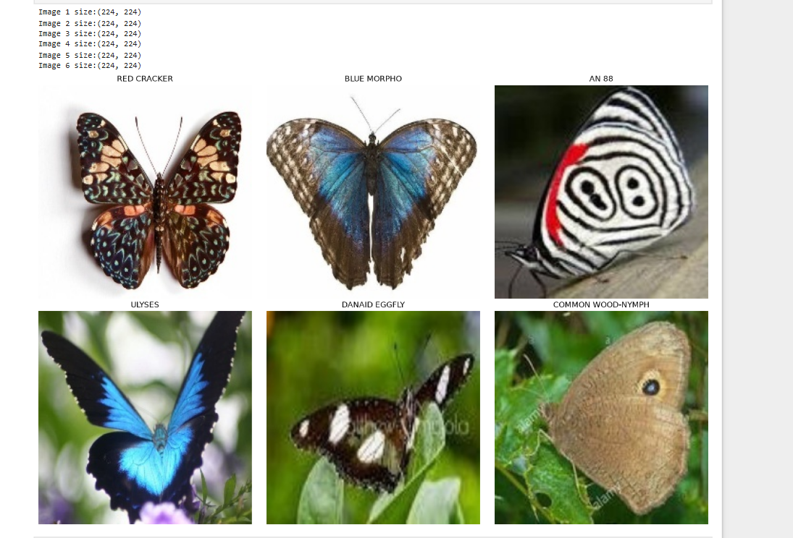
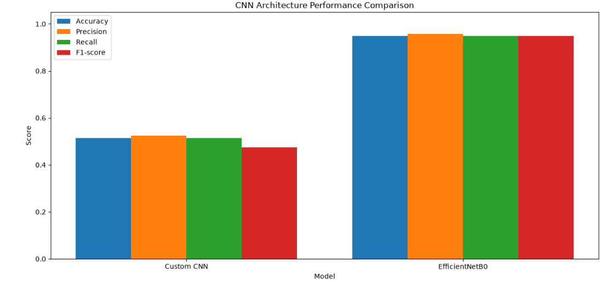
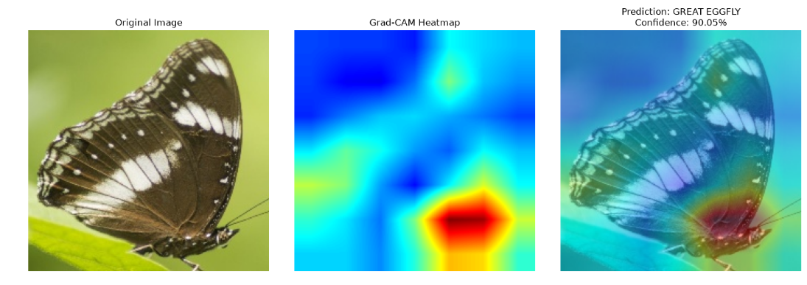

# 🦋 ButterflyVision — 100 Butterfly Species Classification

Deep Learning project for classifying images of **100 butterfly and moth species**.

Two models were trained and compared:
- **Custom CNN** — trained from scratch
- **EfficientNetB0** — Transfer Learning

---

##  Objective

To classify butterfly and moth images into 100 different species and compare a custom CNN with a pretrained EfficientNetB0 model.

---

##  Dataset

**Butterfly & Moths Image Classification 100 Species**
[Kaggle Dataset](https://www.kaggle.com/datasets/gpiosenka/butterfly-images40-species)

### Sample Images


| Split | Images | Classes |
|---|---:|---:|
| Train | 12,594 | 100 |
| Validation | 500 | 100 |
| Test | 500 | 100 |

Images were resized to **224 × 224 RGB**.

---

##  Technology Stack

- Python
- TensorFlow / Keras
- NumPy
- Pandas
- OpenCV
- Matplotlib
- Seaborn
- Scikit-learn
- Jupyter Notebook

---

##  Models

### Custom CNN
CNN designed and trained from scratch.
**Test Accuracy: 51.40%**

### EfficientNetB0
Pretrained EfficientNetB0 using Transfer Learning.
**Test Accuracy: 94.80%**

---

##  Results



| Metric | Custom CNN | EfficientNetB0 |
|---|---:|---:|
| Accuracy | 51.40% | **94.80%** |
| Precision | 52.43% | **95.67%** |
| Recall | 51.40% | **94.80%** |
| F1-score | 47.46% | **94.78%** |


EfficientNetB0 improved the test accuracy by **43.40 percentage points**.

---

##  Grad-CAM

Grad-CAM was implemented to visualize the regions of the image that influenced the EfficientNetB0 prediction.



---

## 📁 Project Structure

```text
ButterflyVision/
│
├── notebook/
│   └── ButterflyVision.ipynb
│
├── results/
│   ├── best_custom_cnn.keras
│   ├── best_efficientnetb0.keras
|   ├── model1_history.json
│   └── model2_history.json
│
├── screenshots/
│   ├── Dataset_Distribution.png
│   ├── Sample__Training_Images.png
│   ├── Custom_CNN_Summary.png
│   ├── Custom_CNN_Training_VS_Acuuracy.png
│   ├── Custom_CNN_loss_Graph.png
│   ├── EfficientnetB0_Summary.png
│   ├── EfficientnetB0Training_VS_Accuracy.png
│   ├── EfficientnetB0_loss_Graph.png
│   ├── Model_Comparison.png
│   ├── Parameter_Comparison.png
│   └── GradCAM.png
│
├── README.md
├── requirements.txt
└── .gitignore
```

---

##  Running the Project

### 1. Clone the Repository

```bash
git clone <your-repository-link>
cd ButterflyVision
```

### 2. Install Dependencies

```bash
pip install -r requirements.txt
```

### 3. Download the Dataset

Download the dataset from Kaggle:
[Kaggle Dataset](https://www.kaggle.com/datasets/gpiosenka/butterfly-images40-species)

### 4. Arrange the Dataset

Place the dataset in the following structure:

```text
dataset/
├── train/
├── valid/
└── test/
```

### 5. Open the Notebook

Open:

```text
notebook/ButterflyVision.ipynb
```

### 6. Run the Project

Run the notebook cells sequentially.
